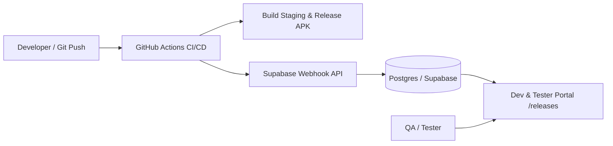

# 🚀 Dev & Tester Documentation

Welcome to the internal engineering and testing documentation hub. This portal provides comprehensive guides for running local environments, executing QA test suites, distributing Android binaries, and reporting issues.

## 📌 Quick Navigation

| Resource | Description | Target Audience |
| :--- | :--- | :--- |
| **[Getting Started](/docs/getting-started)** | Setup local environment, Gradle configs, and keys | Developers |
| **[Testing Guide](/docs/testing-guide)** | End-to-end testing, ADB commands, and QA test matrices | QA / Testers |
| **[App Releases](/releases)** | Direct APK download dashboard & Changelogs | All Teams |

---

## 🛠️ Architecture Overview

The system is built on modern, scalable technologies:

- **Android Client**: Kotlin, Jetpack Compose, Coroutines/Flow, Hilt Dependency Injection, Room Local DB, Retrofit & Ktor.
- **Backend & Database**: Next.js App Router, Supabase PostgreSQL, Drizzle ORM.
- **CI/CD Pipeline**: GitHub Actions automated build & lint workflows triggering release webhooks.

---

## 📱 Tester Release Channels

1. **Staging (`/releases?env=Staging`)**: Daily automated builds connected to mock/staging APIs for active feature testing.
2. **UAT (`/releases?env=UAT`)**: Release candidates connected to production mirror environments for user acceptance.
3. **Production (`/releases?env=Prod`)**: Signed store builds.
